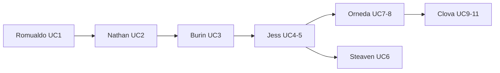

# Roadmap par responsable UC

Index central des roadmaps individuelles pour le **Système de Gestion Hospitalière**. Chaque membre de l'équipe dispose d'un fichier décrivant l'état actuel sur `main` et les prochaines étapes pour atteindre 100 % de son/ses cas d'utilisation.

> Audit technique des branches : [BRANCH-AUDIT.md](BRANCH-AUDIT.md)

---

## Tableau récapitulatif

| Responsable | UC | Spec PDF | Avancement | Roadmap | Branche feature (archivée) |
|-------------|-----|----------|------------|---------|----------------------------|
| Romualdo | UC1 — Prendre rendez-vous | c1-romualdo | ~97 % | [romualdo-uc1.md](roadmap/romualdo-uc1.md) | `feature/uc1-romualdo` |
| Nathan | UC2 — Consulter rendez-vous | c2 | ~90 % | [nathan-uc2.md](roadmap/nathan-uc2.md) | `feature/uc2-nathan` |
| Burin | UC3 — S'enregistrer à l'arrivée | c3 | ~85 % | [burin-uc3.md](roadmap/burin-uc3.md) | — |
| Jess | UC4 — Gérer file d'attente / UC5 — Attribuer numéro | c4 / c5 | ~85 % | [jess-uc4-uc5.md](roadmap/jess-uc4-uc5.md) | `feature/uc4-uc5-jess` |
| Steaven | UC6 — Notifier patient | — | ~65 % | [steaven-uc6.md](roadmap/steaven-uc6.md) | `feature/uc6-steaven` |
| Orneda | UC7 — Déclarer urgence / UC8 — Prioriser urgence | c6 | ~60 % | [orneda-uc7-uc8.md](roadmap/orneda-uc7-uc8.md) | — |
| Clova | UC9 — Consulter liste / UC10 — Appeler / UC11 — Carte | c7 | ~75 % | [clova-uc9-uc11.md](roadmap/clova-uc9-uc11.md) | — |

**Référence intégrée :** toujours travailler sur `main`. Ne pas fusionner directement les branches feature listées ci-dessus.

---

## Flux démo intégré



**Scénario complet :**

1. **UC1** — Réserver un RDV (`/prendre-rendez-vous`)
2. **UC2** — Consulter l'historique (`/mes-rendez-vous`)
3. **UC3** — Enregistrer la présence au kiosk (`/kiosque`, RDV du jour ~#3)
4. **UC4/5** — Distribuer un ticket au guichet (`/file-attente`, patient présent)
5. **UC7/8** — Déclarer une urgence si besoin (`/urgences/declare`)
6. **UC6** — Patient suit son ticket (`/ticket/:id/statut`)
7. **UC9/10** — Moniteur + appel médecin en box (`/moniteur`, `/moniteur/tv`, `/medecin/appel`)
8. **UC11** — Cartographie des établissements (`/carte`)

---

## Prérequis local

Après chaque `git pull` modifiant le schéma SQL :

```bash
cd backend && npm run db:init
```

Tables récentes : `date_du_jour` sur `t_file_attente`, `score_gravite` + `id_medecin` sur `t_cas_urgence`, `t_hopital` pour UC11.

---

## Hors scope (équipe entière)

Ces sujets ne sont pas assignés à un seul responsable UC :

- Authentification JWT par rôle (Patient / Agent d'accueil / Médecin)
- Tests E2E (Playwright)
- Déploiement production (`VITE_API_URL`, HTTPS)
- Notifications SMS / push globales
