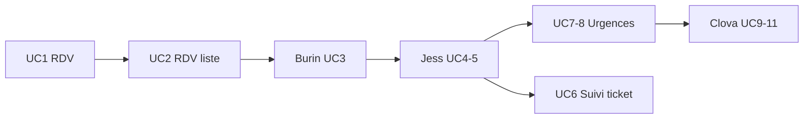

# Roadmap par responsable UC

Index central des roadmaps individuelles pour le **Système de Gestion Hospitalière**. Chaque membre de l'équipe dispose d'un fichier décrivant l'état actuel sur `main` et les prochaines étapes pour atteindre 100 % de son/ses cas d'utilisation.

> Audit technique des branches : [BRANCH-AUDIT.md](BRANCH-AUDIT.md)
> **Note frontend** : la réécriture shadcn/ui par feature est livrée sur `main`. Ce fichier reflète l'état **frontend** (les % et le « restant » concernent l'UI ; le backend est fonctionnel et couvert par une suite de tests manuels 77/77).

---

## Tableau récapitulatif (état frontend)

| Responsable | UC | Feature frontend | Avancement | Restant | Roadmap |
|-------------|-----|------------------|------------|---------|---------|
| Nathan | UC1–UC2 — RDV + UC6 patient | `features/patient` | ~85 % | Pagination, SSE reconnect, créneaux médecin, annulation | [nathan-uc2.md](roadmap/nathan-uc2.md) |
| Burin | UC3 — S'enregistrer à l'arrivée | `features/kiosque` | ~90 % | Scan QR (`?id_rdv=`) | [burin-uc3.md](roadmap/burin-uc3.md) |
| Jess | UC4–UC5 — File / tickets + UC7–UC8 urgences | `features/agent` | ~85 % | Réimpression ticket, stats, alerte ROUGE/ORANGE, triage dashboard | [jess-uc4-uc5.md](roadmap/jess-uc4-uc5.md) |
| Clova | UC9–UC11 — Moniteur / appel / carte | `features/moniteur`, `features/medecin`, `features/carte` | ~85 % | Son à l'appel, clôture médecin, filtres carte | [clova-uc9-uc11.md](roadmap/clova-uc9-uc11.md) |

**Référence intégrée :** toujours travailler sur `main`. Les branches `feature/uc2-*`, `feature/uc4-*`, `feature/uc6-*` archivées ne doivent pas être fusionnées.

---

## Routes frontend actuelles (rewrite shadcn)

| Accès | Routes |
|-------|--------|
| Public (bornes/écrans) | `/kiosque`, `/moniteur`, `/moniteur/tv`, `/carte` |
| Auth | `/login` |
| Patient (rôle PATIENT) | `/patient`, `/patient/rendez-vous`, `/patient/rendez-vous/nouveau`, `/patient/ticket/:id` |
| Agent (rôle AGENT) | `/agent`, `/agent/file-attente`, `/agent/urgences` |
| Médecin (rôle MEDECIN) | `/medecin`, `/medecin/consultation`, `/medecin/historique` |

> Les anciens chemins (`/prendre-rendez-vous`, `/mes-rendez-vous`, `/ticket/:id/statut`, `/file-attente`, `/urgences/declare`, `/medecin/appel`) sont remplacés par les routes protégées par rôle ci-dessus.

---

## Restant frontend par rôle

Récapitulatif des TODO marqués dans le code (`// TODO <owner>: …`) et des dettes portées, triés par priorité. Aucun ne bloque les flux de démo : ils sont des améliorations / fermetures de dette. Les dettes UC6 (Steaven), UC7/8 (Orneda) et UC1 (Romualdo) sont portées par **Nathan** et **Jess**.

### Burin — Kiosque (UC3)

| Priorité | Tâche | Fichier |
|----------|-------|---------|
| P1 | Scan QR code : encoder `id_rdv` dans l'URL (`?id_rdv=`) et lecture automatique à l'ouverture de `/kiosque` | `features/kiosque/components/KiosquePanel.jsx` |
| P1 | Lire `id_rdv` depuis la query/location quand le scan sera branché | `features/kiosque/hooks/useKiosqueRegister.js` |
| P3 | Impression badge « Présent » | — |

### Clova — Moniteur / Médecin / Carte (UC9–UC11)

| Priorité | Tâche | Fichier |
|----------|-------|---------|
| P1 | Sonner à chaque nouvel appel sur `/moniteur` (le flash est déjà actif) | `features/moniteur/MoniteurView.jsx` |
| P1 | Clôturer la consultation depuis l'écran médecin (la route `PATCH /close` est AGENT aujourd'hui) | `features/medecin/ConsultationPage.jsx` |
| P2 | Détecter le box attribué pour l'afficher plus tôt sur le moniteur | `features/moniteur/hooks/useMoniteurQueue.js` |
| P2 | Accéder au triage dashboard depuis le dashboard médecin (endpoint existant) | `features/medecin/MedecinDashboard.jsx`, `features/medecin/hooks/useHistoriquePatient.js` |
| P2 | Sélecteur de patient (liste) au lieu de la saisie manuelle d'ID dans l'historique | `features/medecin/HistoriquePatientPage.jsx` |
| P3 | Afficher le score de gravité dans les constantes vitales s'il est présent | `features/medecin/components/Vitals.jsx` |
| P3 | Carte : filtres par type (CHU, Privé, Public) + recherche d'établissement | `features/carte/CarteHopitauxView.jsx` |

### Nathan — Portail patient (UC1, UC2, UC6)

| Priorité | Tâche | Fichier |
|----------|-------|---------|
| P1 | Reconnexion automatique si la connexion SSE tombe | `hooks/useSseStatus.js` |
| P1 | Mettre en avant le « prochain RDV » + statut du ticket courant sur le dashboard | `features/patient/PatientDashboard.jsx` |
| P2 | Pagination complète de Mes RDV (le backend renvoie `pagination`) ; remplacer les onglets si le volume grandit | `features/patient/hooks/useMesRendezVous.js`, `features/patient/MesRendezVousPage.jsx`, `services/rendezvousService.js` |
| P2 | Ouvrir automatiquement le suivi si le ticket est lié au patient connecté | `features/patient/TicketStatusPage.jsx` |
| P2 | Afficher `numero_box` + badge priorité urgence sur l'écran statut (dette UC6 portée) | `features/patient/TicketStatusPage.jsx`, `features/patient/components/TicketStatusCards.jsx` |
| P2 | Valider l'affichage de `personnes_avant` + estimation de temps restant (`estimation_minutes`) | `features/patient/hooks/useTicketStatus.js`, `features/patient/components/TicketStatusCards.jsx` |
| P2 | Règle client « pas de RDV si déjà réservé » + recherche de créneaux par médecin (le backend renvoie 409) | `features/patient/validation/rdvSchema.js`, `features/patient/BookAppointmentPage.jsx` |
| P3 | Bouton « Annuler » le RDV dès que le backend expose l'annulation | `features/patient/components/BookingSuccessBanner.jsx` |
| P3 | Notification proactive (Notification API / push / SMS) à l'appel — hors UI, dépend d'un service externe | — |

### Jess — Agent / Urgences / Fondation (UC4–UC5, UC7–UC8, shared)

| Priorité | Tâche | Fichier |
|----------|-------|---------|
| P1 | File ROUGE/ORANGE prioritaire en haut du dashboard agent | `features/agent/AgentDashboard.jsx` |
| P1 | Réimprimer le ticket thermique depuis la liste de la file + impression `window.print` du reçu | `features/agent/components/TicketGenerator.jsx`, `features/agent/components/TicketThermique.jsx`, `features/agent/FileAttentePage.jsx` |
| P2 | Temps d'attente moyen par priorité dans les stats + grouper la table par statut | `features/agent/hooks/useFileAttente.js`, `features/agent/components/FileAttenteTable.jsx` |
| P2 | Préremplir `id_patient` depuis le ticket sélectionné + afficher les constantes vitales du dernier cas | `features/agent/hooks/useUrgenceDeclare.js`, `features/agent/UrgenceDeclarePage.jsx` |
| P1 | Alerte visuelle + sonore ROUGE/ORANGE sur guichet et `/moniteur` (dette UC7/8 portée) | `features/agent/`, `features/moniteur/` |
| P2 | Re-priorisation immédiate après `POST /urgences/declare` (recalcul positions affiché en direct) | `features/agent/hooks/useFileAttente.js`, `features/agent/hooks/useUrgenceDeclare.js` |
| P2 | Lien vers le ticket du patient après la déclaration d'urgence | `features/agent/components/UrgenceResultPanel.jsx` |
| P3 | Triage dashboard UI (l'endpoint `GET /urgences/triage-dashboard` existe) — à brancher agent ou médecin | — |
| P3 | QR code sur le ticket thermique → ouvre `/patient/ticket/:id` (dette UC6 portée) | `features/agent/components/TicketThermique.jsx` |
| P3 | `authService.register` dès que le backend l'exposera | `services/authService.js` |
| P3 | Lien « Statut ticket » côté médecin dans le shell si nécessaire | `components/layout/AppShell.jsx` |
| P3 | Variante « compact » de `DataState` si besoin sur les tableaux denses | `components/DataState.jsx` |

---

## Flux démo intégré



**Scénario complet (routes actuelles) :**

1. **UC1** — Réserver un RDV (`/patient/rendez-vous/nouveau`, connecté patient)
2. **UC2** — Consulter l'historique (`/patient/rendez-vous`)
3. **UC3** — Enregistrer la présence au kiosk (`/kiosque`, RDV du jour)
4. **UC4/5** — Distribuer un ticket au guichet (`/agent/file-attente`, patient présent)
5. **UC7/8** — Déclarer une urgence si besoin (`/agent/urgences`)
6. **UC6** — Patient suit son ticket (`/patient/ticket/:id`)
7. **UC9/10** — Moniteur + appel médecin en box (`/moniteur`, `/moniteur/tv`, `/medecin/consultation`)
8. **UC11** — Cartographie des établissements (`/carte`)

---

## Prérequis local

Après chaque `git pull` modifiant le schéma SQL :

```bash
cd backend && npm run db:init
```

- **Base de test** : utilisateurs demo (`marie.dupont@demo.fr`, `agent.accueil@demo.fr`, `jean.martin@demo.fr`, … mot de passe `demo123`).
- **Backend** : `cd backend && npm start` (port 3000). Si 3000 est pris, `$env:PORT=3001; npm start`.
- **Frontend** : `cd frontend && npm start` (port 5173, proxy `/api` → 3000). Les routes publiques (`/kiosque`, `/moniteur`, `/carte`) fonctionnent sans login.

---

## Hors scope (équipe entière)

Ces sujets ne sont pas assignés à un seul responsable UC :

- Authentification JWT par rôle (Patient / Agent d'accueil / Médecin) — **livrée**
- Tests E2E (Playwright)
- Déploiement production (`VITE_API_URL`, HTTPS)
- Notifications SMS / push globales

---

## Note sur les roadmaps individuelles

Les fichiers `docs/roadmap/*.md` sont la référence par UC et ont été **réalignés sur l'arborescence actuelle** : chaque fiche contient une section « Zone à entretenir (frontend) » qui liste les dossiers et fichiers à maintenir par membre, avec les chemins `frontend/src/features/<domaine>/`. Elles doivent rester synchronisées avec le code à chaque évolution.
